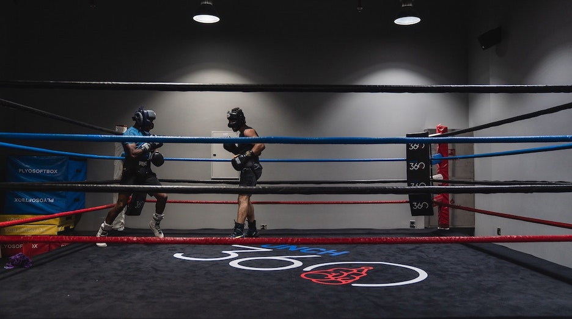

## Who's in the Ring?

Welcome to today’s match-up. If you’re a newbie to Java or JavaScript, you’re in the right place to learn some insight on the two languages from a fellow newbie. In this corner, we have the first language I ever learned to code in Java! Java is a similar language to C (which I have some experience in) and a staple to anyone in the computer science field. And in the other corner, we have a newcomer stepping into the ring, JavaScript! I recently just learned the basic syntax and applications for JavaScript and am excited to pit it against Java and see what sets them apart. 

## Java vs. JavaScript 

I thought Java and JavaScript would be really similar since they have similar names but that wasn’t the case. Right off the bat, compared to Java, I found JavaScript much more flexible. One main difference between the two is that when using Java, you must specify the type of each variable used. And once it’s declared to be a certain datatype (an integer, string, array, etc) it can’t be changed. On the other hand, in JavaScript, it isn’t necessary to specify the datatype you set to a variable. You can also reassign the datatype of a variable after declaring it. This took some getting used to since I’ve conditioned myself to always type ‘int’ or ‘string’ when declaring variables. Another major difference that took me off guard was that Java is a class-based language while JavaScript isn’t. I’m used to using Java and the need to set up classes, main methods, and functions to perform even simple tasks. In JavaScript, there is more freedom. You don’t need classes or main methods, you can write a function and call it right away. It honestly amazed me when I realized how different these two languages are. 

## And the Winner Is...
 
The differences between the two are what makes them so hard to choose between. They both have ideal scenarios they could be used in. From a software engineering perspective, Java is more complex but seems more suitable and practical for bigger projects with lots of code that would benefit from the rigidness of the Java syntax. The freedom JavaScript provides is a double-edged sword because as projects get bigger and more complex, it will be harder to find errors since it allows more than Java. On the other hand, I’ve found learning JavaScript to be a very interesting experience. It was really fun to experiment with the new syntax and learn different ways to write even the simplest lines of code. Since I’ve only learned C and Java before JavaScript, the syntax was honestly hard to wrap my head around but I found JavaScript to be a very unique language that I can see myself falling in love with. It felt like there were more opportunities to think creatively; much more so than Java or C. Personally, at the moment, I like JavaScript more. Ding! Ding! JavaScript has won.

## The Post-Fight

The two fighters shake hands and walk backstage but, the fight isn’t over yet. Not for me at least. I’ve never competed in a sport before so who would’ve thought that the most experience I’d have in athletics would be in computer science! I’m currently taking an introduction to software engineering class that uses a pedagogy called “Athletic Software Engineering”. The purpose behind it is to force us to exercise the skills we learn in this class much like any other sport. We are constantly given timed problems called Workout of the Days (WODs) in and out of class to keep us exercising and on our toes. This forces us to keep up with our training outside of class so we can perform well when it counts. I’ve found this type of learning style very stressful as there is constant pressure to know what you’re doing at all times. However, I believe that this type of pressure will be helpful in the long run. The skills you learn from competing such as critical thinking, building character, and never giving up apply to learning any code. In the end, when it comes to Java or JavaScript, I’m looking forward to delving deeper into what it means to be a software engineer and growing as a computer science athlete. 
 
