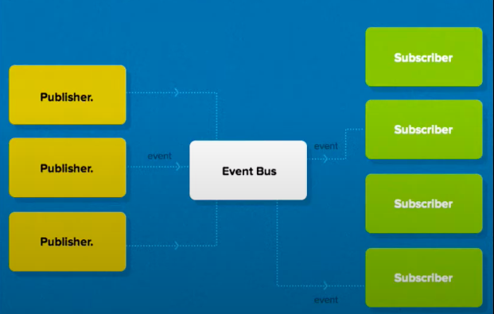

## Mmmmm… Cookies
I’ll be honest, I’m not the biggest fan of sweets. Candies and chocolate coat my mouth with too much sugar, and I can never finish a slice of cake or an entire brownie in one sitting. However, the one exception to this is cookies. They’re not too overly sweet and are bit-sized so I can enjoy them all in one go. Plus, they’re pretty easy to make compared to cakes or other desserts. My all-time favorite cookie is a classic, freshly baked, soft on the inside, crispy on the outside chocolate chip cookie…. Mmmm.


## Wait, Why Are You Talking About Cookies?
I bring up my love of cookies because that is what immediately popped into my mind when I first learned about design patterns. I was first introduced to the concept of design patterns in the software engineering class I am currently taking. I was excited at first because I thought design patterns meant patterns in design, such as using repetition, patterns, and rhythm in visual design. I guess I should’ve known better since it is a software engineering class, not a web or graphic design class. Despite this initial disappointment, I was pleasantly surprised and found the idea of design patterns more intriguing the more I looked into them.

If I could describe design patterns in one phrase, it would be “working smarter, not harder”. They’re a template, a handy tool in your belt that you can whip out whenever you’re faced with a coding task. The idea of a design pattern is so cool to me. They’re descriptions on how to approach common programming problems. They’re templates on how to code that have been approved by the community and have been worked on for years and years by many, many, programmers who have come before me. It feels like they’re nuggets of wisdom that are passed down by each generation of programmers.

## So, How Are They Connected to Cookies?
I bring up cookies because I see the process of coding and design patterns' role in it as very similar to baking a cookie and cookie cutters' role in it. Baking a cookie is like coding a program. You know that your end goal is a program that does a specific task, which in this metaphor is a freshly baked cookie. Once you know the ingredients of the cookie recipe and the steps to take, you’ll have a finished cookie. The components of the program are like the ingredients and finding the right process (where and when to call functions, etc.) is like following the right steps. Design patterns are the cookie cutters, if they are in the shape of what you need your cookie to be made into, they make the whole process easier. In the same way, design patterns provide reliable, efficient ways of making the coding process easier.


As helpful as tool design patterns are, you can’t expect to write professional-level code with just design patterns. You could have all the cookie cutters in the world, and still not be able to make a cookie in every shape possible. Cookie cutters are just templates, no matter what you do, if all you have are cookie cutters in the shape of hearts, you can’t use them to make a cookie in the shape of a star. In the same way, design patterns can be an inspiration for a solution instead of an actual implementation. Just because your code utilizes a design pattern, it does not mean it’s the most efficient and they aren’t relevant to every problem imaginable.


## One Tough Cookie
Much like when it comes to baking, when it comes to design patterns, I'm just a beginner. In my current software engineering class, we have been working and learning about the observer design pattern and more specifically, the publish/subscribe pattern. 



You have a set of data sources (the publishers) and they specify how data is made available provides that data to an event bus. When there is a new state from a publisher, the event bus notifies all the subscribers that are concerned about that publication of the change. This is a fundamental design pattern in Meteor and it was so interesting to learn how it worked and see it in action in our code. For example: 
````
```
publish() {
  if (Meteor.isServer){
    Meteor.publish(this._collectionName, () => this._collection.find());
  }
}
```
````
We used this in a class that defined a base collection and when invoked, it created a Meteor publication that made it so when you subscribe to that publication, you will have access to everything in the entire collection. So, any part of the program that needed access to any part of this collection could have it. 


Now that I've learned a little bit about design patterns, how can I use this new tool in my tool-belt to make my code more functional? Effective? Cleaner? I’m excited to try various design patterns in my code. From now on, when faced with a coding problem, I'll ask myself: "What's the best way to make this cookie?"  


