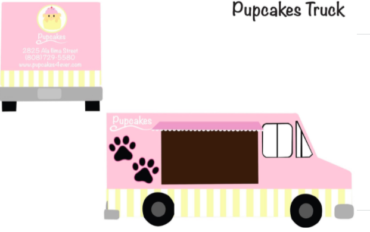
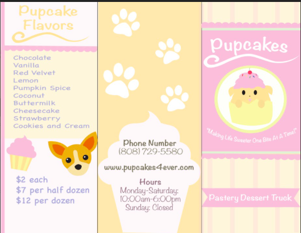
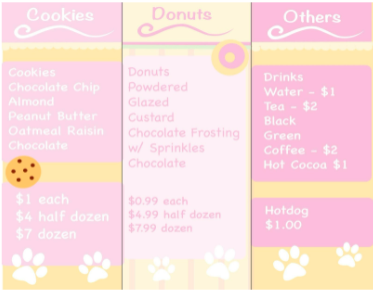
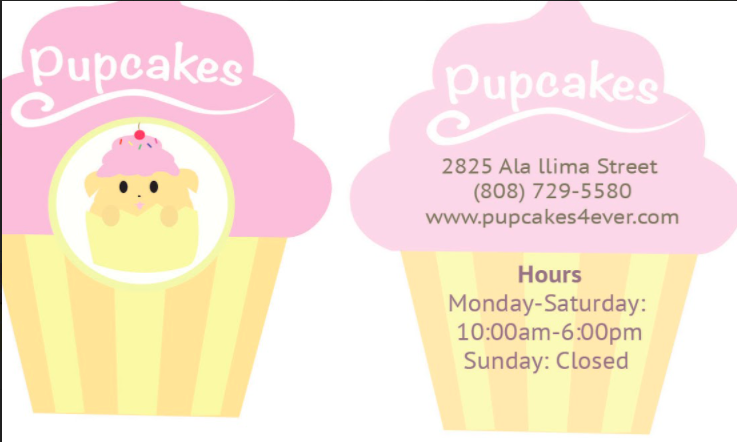

## Food Truck Project 
The objective of this project was to pair with another student and collaboratively create a lunch truck design that incorporated a brand identity. We were tasked with making designs for a food truck, take-out menu, business card, menu poster, and more. We first brainstormed ideas and decided on a cute concept to target younger demographics. We then decided on having a dog theme that would serve desserts and drinks; hence the name Pupcakes. 

For this project, I made the initial sketch for the logo and made the final product in Adobe Illustrator. From there we used the concept and colors of the logo to create the rest of the materials. We tried to emphasize repetition in our project through the aesthetic and colors. My partner sketched the concepts for our products while I personally designed and made the logo, menu, and business card on Adobe Illustrator. 

## Skills I Developed

This project was ongoing for quite some time. I learned to manage my time well and how to collaborate with another person. It was important to be constantly communicating and bouncing ideas off of one another as well as planning out the best ways to divide work. I learned how to stay consistent with a theme and some basics of graphic design principles such as repetition and balance. It was also a good experience in applying my Adobe Illustrator skills. 

