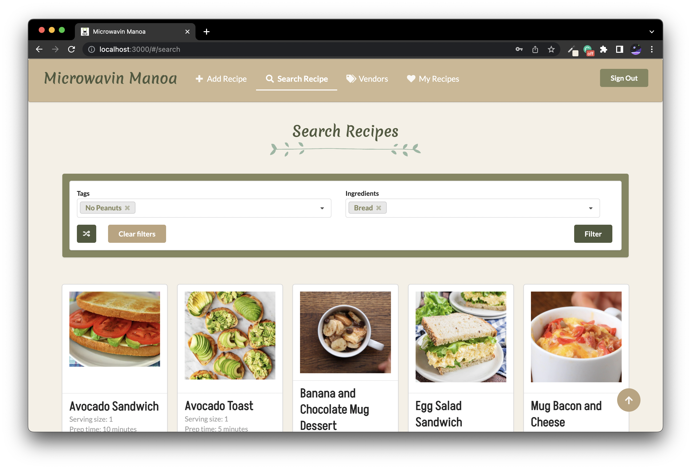

  
  
## Details of the Project 

The problem we tried to solve with this application is the issue of college students being limited in their access to kitchen appliances, time, cooking skills, and grocery stores and having access to recipes that respect these constraints. Many college students spend a lot of money eating fast-food, eating out, or turning to unhealthy alternatives like microwave ramen and chips. Our application was designed to address this problem by making a platform where UH Manoa students could share and look up simple and easy recipes that are easy on the wallet and time.

Our application allowed users to make an account associated with their email. Once logged in, users could look at different recipes by inputting desired filters such as vegan or peanut-free options. Every recipe had an image, description, estimated time, serving size, and estimated cost depending on the cost of the ingredients according to nearby vendors. A user could also make recipes, which would be added to the collection and viewed on the search recipe and my recipe page. 

For more information or if you are curious, the link to the Organization Github Page as well as the source code is [here](https://microwavin-manoa.github.io/).

##  My Contribution 
This was the final project for my ICS 314 Software Engineering class. On top of that, it was a group project where I worked with three of my peers. Our team met twice a week in person for a few hours and then called remotely once on the weekend to follow-up. We managed our tasks by making a list of tasks at each meeting, and then finishing them by the next so more could be added. Meeting so consistently also allowed us to help one another debug our code and check up on one another. 

I helped work on the backend with making the initial collections and add and edit functionalities for the recipes. However, I mostly worked on the frontend part of the development by choosing the color palette and fonts, designing the navigation bar and tables, as well as various pages in the application.  

## What I Learned 
This was the biggest project I've ever worked on in my computer science career. I learned a lot about effective communication and how to best distribute work and tasks. I was able to apply many skills I had learned in my software engineering class such as functional programming in Javascript, how to use HTML and CSS, as well as UI design. I'm incredibly proud of what our team was able to make in the time we were given and I'm looking forward to doing more group projects in the future. 

