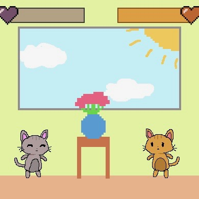

  
  
## Details of the Project 

Kat Battle is a simple 2-person fighting game I made using JavaScript as the final project for my Intro to Computer Science class in high school. The game was made using code.org and used a library called Blockly that allowed users to code in JavaScript. This was one of the first projects I've made in my Computer Science career and it instilled in me the desire to continue my journey in this field. This project taught me how to design and implement a game and make simple animations by hand. 

My game is a two-player fighting game with cat characters and uses keyboard controls for input. On the character select screen, you use the arrow keys and spacebar to select each of the player’s characters. If you’re player one, you use A,W,D to move and V to attack and if you’re player two you use the arrow keys to move and K to attack. Every time someone is hit their health bar goes down and the first person to get the opposing person’s health bar all the way down wins. 

## What I Learned 
Despite this being a very simple game, it taught me how coding even the simplest of things can require repeated bashing of heads against walls and late nights kept up in frustration. At one point, I had over 1,800 lines of code that didn't work because I had so much I wanted to try and do. I kept adding and adding lines of code without seriously testing at each step. In the end, I had a big pile of messed-up code. I had to breathe, take a step back and start from scratch. This taught me that trying to jump straight into coding without thinking before starting to think through a solution to a problem first is dangerous. It also taught me the basics of JavaScript as well as animation. I learned about different forms of input, how to check for collisions, and physics for character movement. 

The link to the game as well as its code is here. - [URL to game](https://studio.code.org/projects/gamelab/2bTFOeRfpdFYboQyz1Gr0peGUkzgO-M9-lYVZNHb9PQ).

