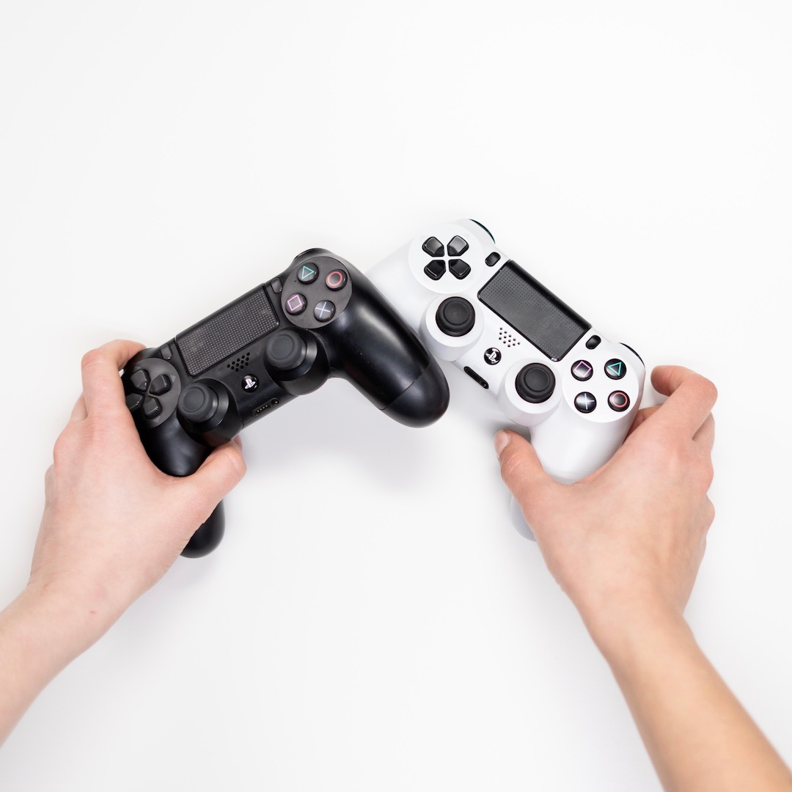

  

## 

Kat Battle is a simple 2-person fighting game I made using JavaScript as the final project for my Intro to Computer Science class in high school. This was one of the first projects I've made in my Computer Science career and it instilled in me the desire to continue my journey in this field. This project taught me how to design and impliment a game and make simple animations by hand. 

This is a desciption of the game: My game is a two-player fighting game with cat characters. In the character select screen, you use the arrow keys and spacebar to select each of the player’s characters. If you’re player one, you use A,W,D to move and V to attack and if you’re player two you use the arrow keys to move and K to attack. Every time someone is hit their health bar goes down and the first person to get the opposing person’s health bar all the way down wins. 

Despite this being a very simple game, it taught me how coding even the simpliest of things need sufficent time and effort to do well. It also taught me the basics of JavaScript and 

The link to the game as well as its code is here. - [URL to game](https://studio.code.org/projects/gamelab/2bTFOeRfpdFYboQyz1Gr0peGUkzgO-M9-lYVZNHb9PQ).

